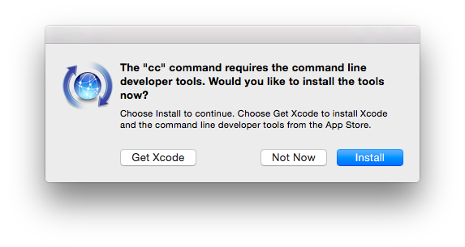

# @title Install ruby-oci8 on OS X

This page explains the way to install ruby-oci8 os OS X.

Look at [Instant clinent](install-full-client), {file:docs/install-instant-client.md}
or {file:docs/install-binary-package.md} for other platforms.

Install C compiler
==================

You need to install the command line developer tools or the Xcode.
(The latter includes the former.)

Run `"cc --version"` in a terminal to check whether they are installed.

If the cc version is printed, the tools are installed.

If the follwoing dialog is displayed, click its Install button to
install the tools.
You have no need to install the Xcode to compile ruby-oci8.
It requires command line tools, not an IDE such as the Xcode.

If `"Agreeing to the Xcode/iOS license requires admin privileges,
please re-run as root via sudo."` is printed, you need to run
`"sudo cc --version"`, enter your password, look at the license
and type `"agree"`.

Install Oracle Instant Client Packages
======================================

Download Oracle Instant Client Packages
--------------------------------

Download the following packages from [Oracle Technology Network][]

* Instant Client Package - Basic or Basic Lite
* Instant Client Package - SDK
* Instant Client Package - SQL*Plus (optionally)

Install Oracle Instant Client Packages via Homebrew
---------------------------------------------------

To install `Oracle Instant Client Basic Lite` via [Homebrew][]

* Download two instant client packages: `Basic Lite` and `SDK` and put them
  in `/Library/Caches/Homebrew` (if the environment variable `HOMEBREW_CACHE`
  is not set and `$HOME/Library/Caches/Homebrew` doesn't exist.)
* Run the followining commands:

        brew install InstantClientTap/instantclient/instantclient-basiclite
        brew install InstantClientTap/instantclient/instantclient-sdk

To install `Oracle Instant Client Basic` via [Homebrew][]

* Download *three* instant client packages: `Basic`, `Basic Lite` and `SDK`
  and put them in `/Library/Caches/Homebrew` (if the environment variable
  `HOMEBREW_CACHE` is not set and `$HOME/Library/Caches/Homebrew` doesn't exist.)
* Run the followining commands:

        brew install InstantClientTap/instantclient/instantclient-basic
        brew install InstantClientTap/instantclient/instantclient-sdk
        
* Set the environment variable OCI_DIR while performing the following installation steps
  if Homebrew is installed outside `/usr/local`.

    export OCI_DIR=$(brew --prefix)/lib

Install Oracle Instant Client Manually
---------------------

If you don't use [Homebrew][], do the following:

Unzip the packages as follows:

    mkdir /opt
    mkdir /opt/oracle
    cd /opt/oracle

Copy downloaded files to /opt/oracle before running the following commands.

    unzip instantclient-basic-macos.x64-11.2.0.4.0.zip
    unzip instantclient-sdk-macos.x64-11.2.0.4.0.zip
    unzip instantclient-sqlplus-macos.x64-11.2.0.4.0.zip

Make a symbolic link to link the library.

    cd /opt/oracle/instantclient11_2
    ln -s libclntsh.dylib.11.1 libclntsh.dylib

Fix the library install and identification names using [fix_oralib][] to make them work
without `DYLD_LIBRARY_PATH`.

    cd /opt/oracle/instantclient11_2
    curl -O https://raw.githubusercontent.com/kubo/fix_oralib_osx/master/fix_oralib.rb
    ruby fix_oralib.rb

Set the environment variable OCI_DIR while performing the following installation steps.

    export OCI_DIR=/opt/oracle/instantclient11_2

Installation
============

If you get a problem in the following steps, look at {file:docs/report-installation-issue.md}.

gem package
-----------

Run the following command.

    gem install ruby-oci8

tar.gz package
--------------

### Download the source code

Download the latest tar.gz package from [download page][].

### Run make and install

    tar xvfz ruby-oci8-VERSION.tar.gz
    cd ruby-oci8-VERSION
    make
    make install

[download page]: https://bintray.com/kubo/generic/ruby-oci8
[Homebrew]: http://brew.sh/
[fix_oralib]: https://github.com/kubo/fix_oralib_osx
[Oracle Technology Network]: http://www.oracle.com/technetwork/topics/intel-macsoft-096467.html
